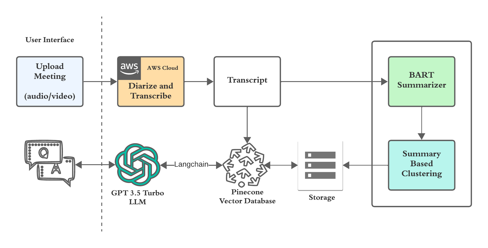

# DOC

# Architecture Diagrams

## Architecture

## Data Store

## Inference

## Clustering

## Models

# Documentation

- [AWS Transcribe Docs](https://docs.aws.amazon.com/transcribe/)
- [Pinecone Docs](https://docs.pinecone.io/docs/overview)
- [Open AI Docs](https://platform.openai.com/docs/introduction)
- [Langchain Docs](https://python.langchain.com/docs/get_started/introduction)
- [Gemini Docs](https://ai.google.dev/docs)
- [Mistral Docs](https://docs.mistral.ai/)
- [Anthropic AI Docs](https://docs.anthropic.com/claude/docs/intro-to-claude)
- [FAISS](https://deepnote.com/blog/semantic-search-using-faiss-and-mpnet)
- [Sentence Transformer](https://www.sbert.net/)

- [University Linkedin Post](https://www.linkedin.com/posts/seattle-university_last-week-students-enrolled-in-our-ms-in-ugcPost-7175530662689411073-L-f8?utm_source=share&utm_medium=member_desktop)
